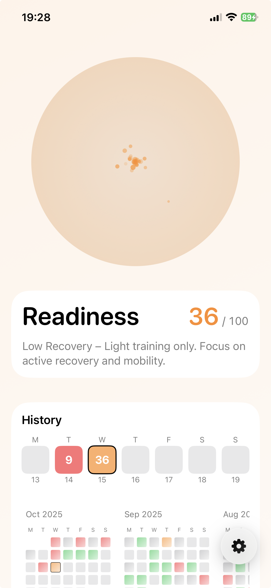
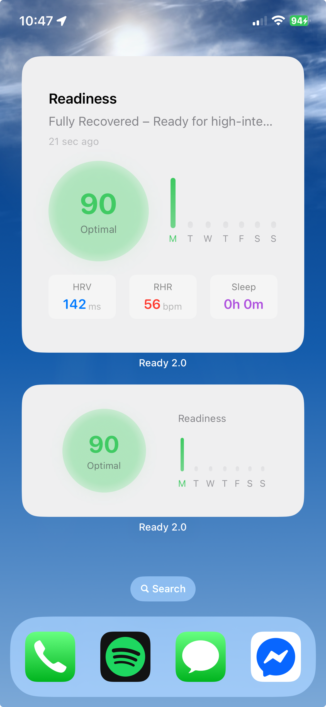

## Ready 2.0 — HRV Readiness (SwiftUI + MVVM) Experiment

### What this is

Ready 2.0 is a learning project built to explore SwiftUI, MVVM, Core Data, HealthKit, BackgroundTasks, and WidgetKit. It computes a daily "readiness" score primarily from heart rate variability relative to a personal baseline, with optional adjustments from Resting Heart Rate (RHR) and Sleep. The purpose of a readiness score is to determine your training and recovery status. Are you up for a tough interval session or need ane extra day of rest?

- **Platform**: iOS (SwiftUI)
- **Architecture**: MVVM with services and storage layers
- **Data Sources**: Apple Health (HRV required; RHR/Sleep optional)
- **Purpose**: Educational/experimental; not medical advice

### The idea

Ready 2.0 is a minimal, on-device readiness companion. It turns your daily HRV into a simple readiness score relative to your personal baseline, with optional adjustments from Resting Heart Rate and Sleep. The goal is clear, consistent feedback you can glance at in the app or widgets—optimized for learning SwiftUI/MVVM patterns rather than being a medical product.

**HRV Baseline Interpretation:**
A sustained increase or decrease in heart rate variability (HRV) relative to a personal baseline has been shown in research to reflect changes in autonomic balance and recovery status. Short-term fluctuations are normal, but multi-day trends are more reliable indicators of systemic stress and recovery capacity.
- Higher HRV over baseline generally indicates improved parasympathetic activity, better recovery, and greater adaptability to stress and training.
- Lower HRV over baseline is associated with elevated sympathetic activation, fatigue, or physiological strain from stress, illness, or insufficient recovery.

[(Plews et al., 2013)](https://pubmed.ncbi.nlm.nih.gov/23852425/)

### Preview

  
  
    

### How it works (brief)

- **HRV window**: Morning mode (00:00–configurable end hour).
- **Baseline**: Personal HRV baseline over a selected period (7/14/30 days) 7-day is recommended, using only valid prior days (as-of baselines for historical days).
- **Score**: From HRV deviation, with optional negative adjustments for elevated RHR and poor sleep.
- **History**: Chronological (oldest→newest) recomputation with per-day as-of baselines; cancellable with progress.
- **Background**: Schedules around 06:00, checks staleness, updates widget data.

### Key features

- **Configurable morning window**: End hour applied across UI and calculations
- **As-of baselines**: Historical days never include their own data in baselines

### Limitations and disclaimers

- **Experiment for learning SwiftUI/MVVM**. Functionality and scores are for information only and may change.
- **Not a medical device**. Do not use for diagnosis or treatment decisions.
- **Results depend on data quality and consistency** (Apple Health availability, watch wear, conditions).

## HRV as a readiness proxy: key constraints

As discussed broadly in the coaching/physiology community (and echoed in this explainer video: [HRV limitations overview](https://www.youtube.com/watch?v=IJFkkA5qh5E&ab_channel=TheUnlazyWay)), HRV has material constraints:

- **Context sensitivity**: HRV varies with stress, sleep, illness, alcohol, hydration, caffeine, and time of day. Trends >> single days.
- **Measurement consistency**: Reliable insights require consistent timing/method (e.g., overnight window). Changing modes affects comparability.
- **Device and data quality**: Sensor differences, firmware changes, motion artifacts, and gaps can skew values. Outliers/very low readings are filtered.
- **Individual variability**: Absolute HRV differs widely. Personal baselines (and deviations) are what matter.
- **Lag and ambiguity**: HRV is non‑specific and may lag training load/illness/psychological stress. It doesn’t prescribe action by itself.
- **Confounders**: Breathing rate, posture, temperature, and acute stressors influence readings.
- **Baseline sufficiency**: Too few valid days degrade stability; longer windows are steadier but respond slower.

This app mitigates some issues via personal baselines, valid‑day gating, morning/rolling windows, optional RHR/Sleep adjustments, and clear unknown states when data are insufficient—but limitations remain inherent to HRV.

### Privacy

- Data is stored on‑device (Core Data, UserDefaults).
- Widgets read last computed values via the app group.

### Developer quick start

1. Open `Ready 2.0.xcodeproj` in Xcode and set signing.
2. Build/run on a device or simulator (Health data availability varies).
3. Grant Health permissions in‑app.
4. Use Settings → Advanced to trigger historical recomputation/backfill if needed.

